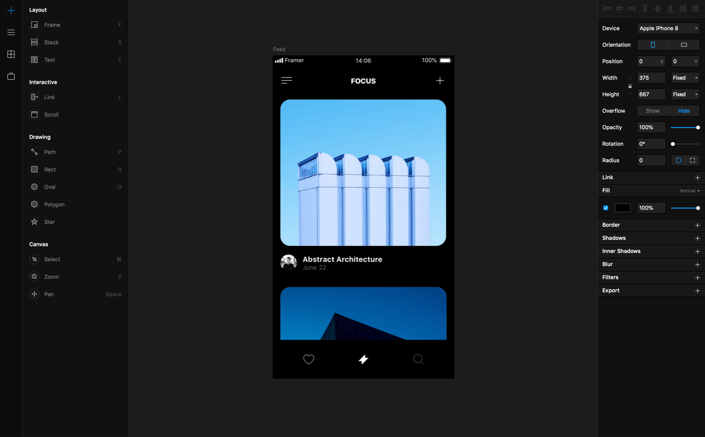
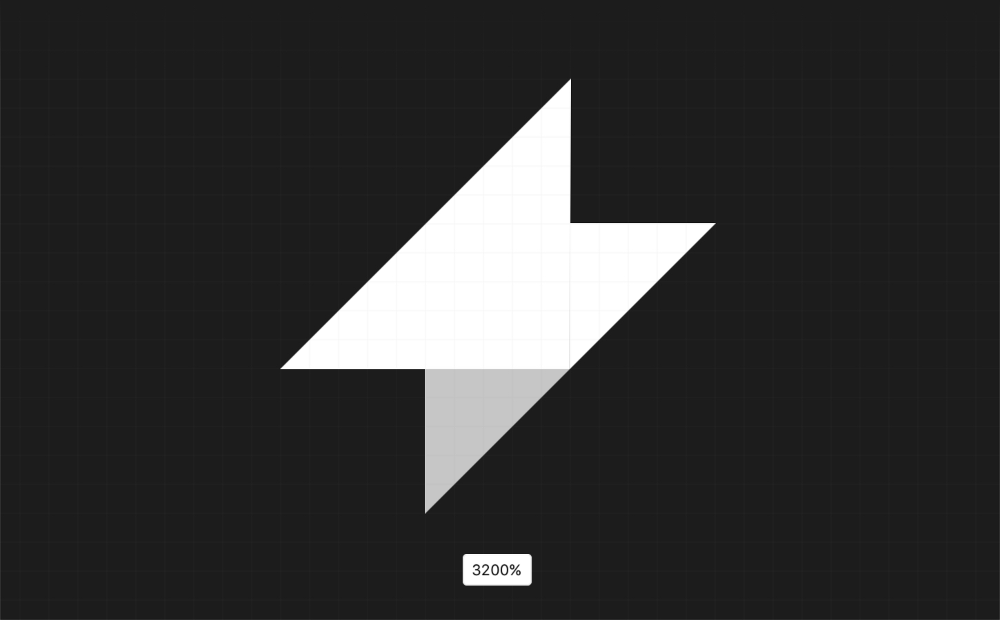
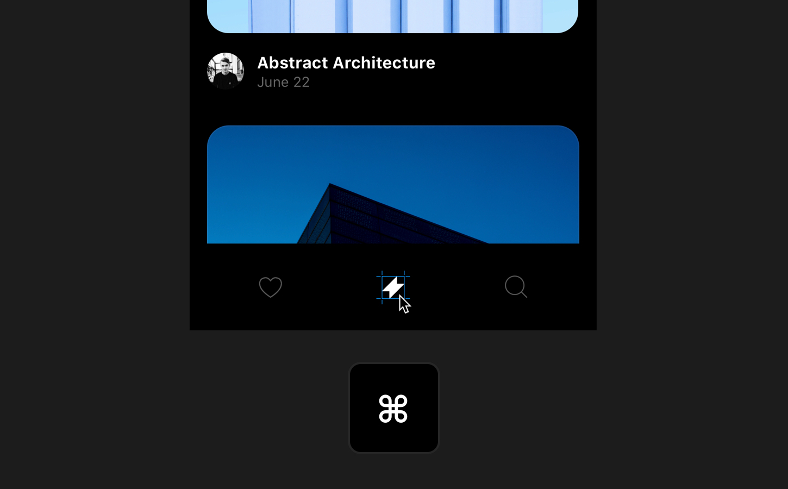
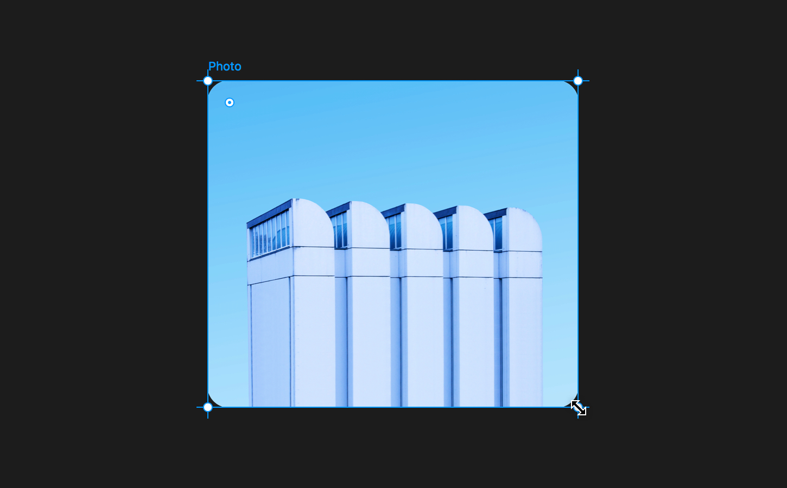
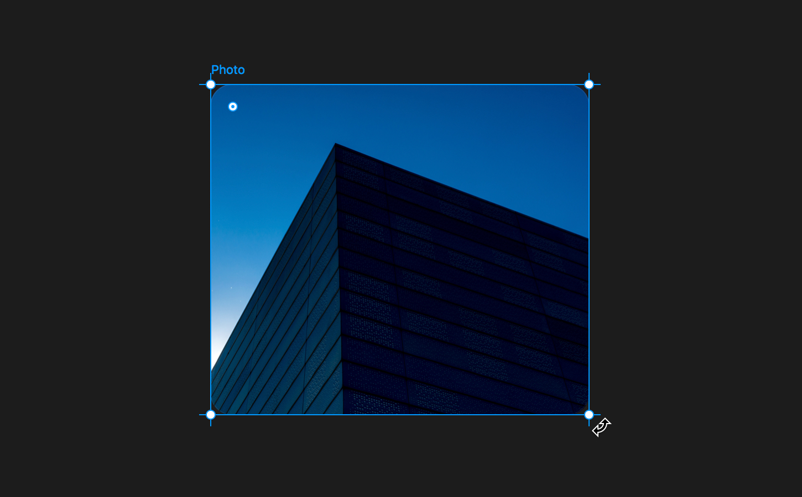

# Canvas

## Canvas

Your Canvas is ground zero for experimenting with concepts and mocking up flows. Draw directly on the canvas or insert device-specific frames. Use these docs to learn the basics of our interface and features.

Framer X its interface will be familiar to most, with a large canvas, device preview, and full-featured toolkit. Like many of the other graphics tools you already use, Framer offers the same insertable shapes and text, all easily styled using the properties panel.

It offers a blank canvas to explore ideas through quick concepts, one-off mockups or to create advanced designs on. You can draw directly on the canvas, import images and insert icons. Or set up a series of frames to create a multi-screen app flow.

Designing on the canvas works great for smaller interactions, but we recommend using frames for complex and responsive app flows. No matter how you like to work, our canvas supports your design flow.

## How it works

### Pan

When working on the canvas, you can use the pan tool to quickly pan over your canvas. Select the pan tool or hold down spacebar, then click and drag to pan your canvas in any direction.

### Zoom

You can use the Zoom tool \(or use the shorthand `Z`\) to quickly zoom in and out on anything that is on your canvas. You can zoom the canvas to as small as 10% \(to get a great overview of all your Frames\) or zoom in all the way up to 3200% to focus on the nitty gritty.

### Direct selection

You can easily select any layer on the Canvas by simply clicking on them. Often, you know exactly which layer you want to select. In those cases we allow you to speed up the process and hold `⌘` while you make your selection so that you are able to directly select that Frame inside of another Frame its Frame.

### Resize

The four handles surrounding your Frame or Shape do not only indicate a selection, but you can also use them to resize the object. Select a handle and drag them to resize the object. Hold `Shift` and it will resize it by proportion, keeping the height and width at the same ratio.

### Rotation

When you reach just outside of one of the four handles of your Frame or Shape you will see the possibility to rotate the object. Alternatively, you can do this in the properties panel under _Rotation_.

### Radius

Go into the corner of a Frame or Shape and click the the circle: you will now be able to drag it to the center or from it to adjust the radius of the object. Alternatively, you can do this in the properties panel under _Radius_.

### Snapping

_This section of the docs is coming soon._

## Frames \(as screens\)

_This section of the docs is coming soon._

