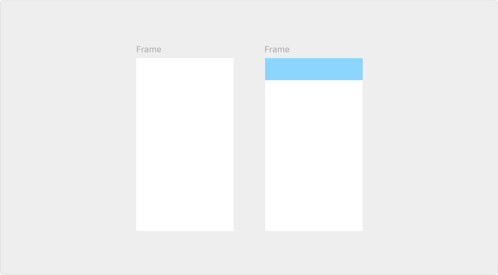
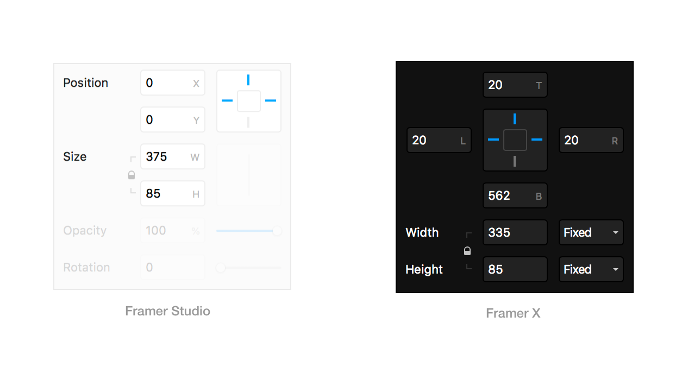

# Layout

## **Layout**

Where Framer X starts to feel different is in the focus and power of its layout design feature set. Because our layout tool has been developed specifically for interactive design work it is able to make smart layout and hierarchy decisions for you. It intuitively guesses relative positioning and alignment making for a much more efficient flow when it comes to responsive design work.

## **Frames and Shapes**

In Framer there is a distinction between a Frame and a Shape. Let's dive into that a bit!

**Frames**
Frames are smart layout containers that can be used for screens and interface elements like buttons and navigation bars. Use Frames to create screens and nested Frames to create interface elements.

**Shapes**, on the other hand, are simple SVG elements that can be grouped, though they don’t inherit any constraints. See a full comparison below.

### Frames

- **Shortcut**: `F`
- **Automatic Nesting**: Yes
- **Layout Constraints**: Yes
- **Used for**: Screens and Interfaces
- **Element**: DIV
- **Wrapping Frames**: `⌘`+`Enter`

### Shapes

- **Shortcuts**: `R` \(Rectangle\), `O` \(Oval\), `P` \(Path\)
- **Automatic Nesting**: No
- **Layout Constraints**: No
- **Used for**: Icons and Illustrations
- **Element**: SVG
- **Adding Groups**: `⌘`+`G`

### Differences

Framer is both a layout and drawing tool in one. Layout is defined using Frames that allow you to quickly set up the structure of an interface, including automatic layout rules that depend on the Frame its size and position.

Icons or illustrations typically need a fixed layout between the different elements. For example, if you draw an icon, you’ll always want each element to scale proportionally, so layout rules don’t really make sense here. To position an icon within an interface, simply wrap it in a Frame by hitting `⌘`+`Enter` .

**Can Frames be nested?**
Yes. Frames can be nested within Frames to define layout elements like navigation bars, tab bars, cards, buttons, and more.

**How do I make my icons adaptive?**
Add a Frame \(`⌘`+`Enter`\) to make your icons scale automatically with your UI.

**Can I export Frames to SVG?**
Yes. If a Frame only contains SVG Shapes, it can be exported as SVG.

**Can I export SVGs with a custom viewbox?**
Yes. If a Frame contains a single SVG element, it can be exported as SVG. By resizing the Frame, you can influence the Viewbox.

## **Layouts**

### **Positioning**

Frames are automatically responsive in Framer X. So when you are designing for different screen sizes, you won't need to continuously change the width of the elements on your Canvas. Framer will just do this for you. How this works is that you tell Framer the distance from the border of the outer Frame and it will then use the remaining area to calculate the height and width of your element. So instead of placing your design on a X/Y axis, you can just tell the margins instead:

_Nesting Stacks_

### Automatic hierarchy

By focusing on automatic hierarchy and relative layout positioning, Framer X lives up to the demands of modern day interface design.

When you place a layer on the canvas in Framer, it is smart enough to guess the layer’s hierarchy based on its visual position. This sequencing will also be noted in the order displayed in the layer panel.

In this way, almost everything you place on the canvas will be ordered according to a parent-child relationship. Because we automatically guess hierarchy this way, you won’t have to worry about grouping any longer.

## **Stacks**

### How it works

To take layouts a step further, we now have a brand new Stacks tool. Stacks are especially good for expressing truly fluid layouts, because it can automate things such as distribution and alignment. You can use the Stack tool by pressing `S` and then by making a selection on top of all the items that need to be fitted inside of it. Release and voila: Everything is now perfectly aligned and distributed within the Frame.

You can further customize your Stack by using the properties panel. If you want to change the way the elements are distributed or if you want to adjust the gap and padding.

### Distribution

Automatic distribution of your items is where the Stack tool really shines. Say you have a menu and you wish to replace the order of the items in there. With Stacks it as simple as a drag-and-drop:

### Nesting

You can even nest multiple stacks inside of a larger stack. Once grouped, you can re-arrange items within each individual stack but also within the larger grouped stack.

## Tutorial

Find out more about our Layout tools via our YouTube channel: [https://www.youtube.com/watch?v=QQ66FU-TYCw&list=PL9p5auxyrweNVMAzsrEd9DmsM25U8ij1M&index=3&t=0s](https://www.youtube.com/watch?v=QQ66FU-TYCw&list=PL9p5auxyrweNVMAzsrEd9DmsM25U8ij1M&index=3&t=0s)
