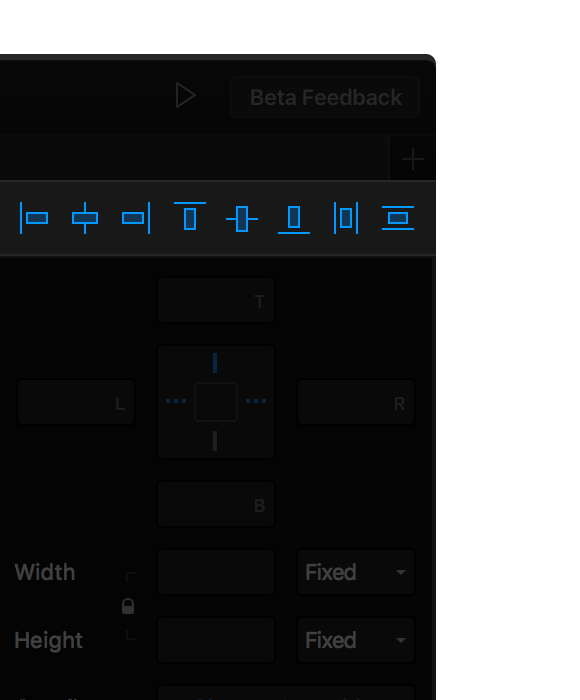
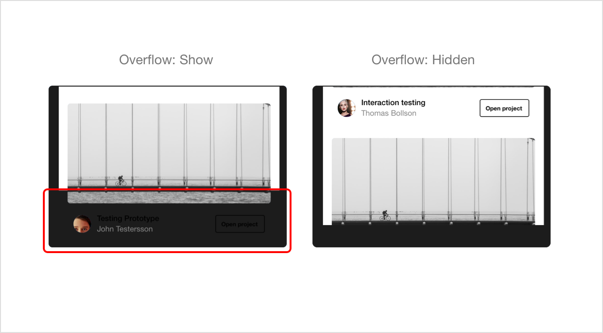

# Properties

Style elements of your layers like size, radius, fill, multiple shadows, gradients and effects. Use the alignment tools and live simulation to accurately position layers for instant responsiveness.

On the right side of the design canvas, you’ll find a properties panel. Much like any other graphics tool, it contains all the tools you need to style the properties of a particular layer. At the top of the panel is a series of align tool options. Use them to smartly position your layers within the frame and in relation to each other.

## **Alignment**

You can easily align your layers \(Frames and Shapes\) by using our alignment features found in the properties panel. You can choose from:

* Align Left
* Align Center
* Align Right
* Align Top
* Align Middle
* Align Bottom
* Distribute Horizontally
* Distribute Vertically

## **Frame Properties**

You can alter the properties of your frame, such as changing its fill color, size or position. To test the responsive nature of your frames, select one or more at a time to bring up its properties, then switch devices. If all your content is correctly aligned, it will automatically adapt to the new dimensions of your frame.

## Overflow

If a layer is going to fall outside of the dimensions of your Frame then you can choose to either display or hide the overflow:

## **Layer Styling**

To view the styling properties of your layers, you can select one or more layers in the layer list or highlight them directly on your canvas. Framer contains all of the styling properties you would expect from a modern design tool.

### **Fill**

You can fill any Frame or Shape with either a color, gradient or image-fill.

#### Color

Colors in Framer are based on the HEX-model \(Hexadecimal\). You can also choose to use the HSL \(Hue - Saturation - Lightness\) or RGB \(Red-Green-Blue\) model.


If you wish to quickly select a color from another layer or image then use the Pick Color tool, or CTRL + C


#### **Linear Gradient**

Gradients in Framer are based on the [CSS Model](https://medium.com/@patrickbrosset/do-you-really-understand-css-linear-gradients-631d9a895caf). This means our gradients are simple—an angle and two color stops. Resizing a layer will not impact the gradients because it will stay true to its angle and automatically adapt to the layer size.

#### Image-fill

You can also select any image from your computer to fill your Shape or Frame. It will then automatically _fill_ itself in the available space. You can also choose to _fit_ or _stretch_ the image.

### Borders

Borders lets you add a border around any layer you create in Framer. You can control the color, width, and style of the border. Because Framer is web based, you’ll be able to set border styling and individual border size for the top, right, bottom, and left of the layer.

### Shadows

Framer allows you to shadows to your desired layer. From outer to inner shadows, you can stack a combination of as many shadows as you want.

### **Effects** 

Effects add an extra set of styling capabilities, including blending modes to blend layers and colors, object blur to blur an entire object, or background blur to blur the layers behind it. There are also filters like Contrast, Grayscale, Hue Rotate, Invert, Saturate and Sepia, for enhanced photo editing.

